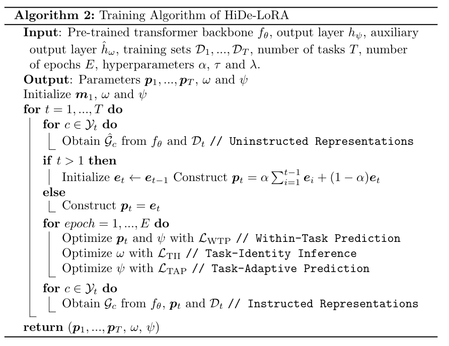
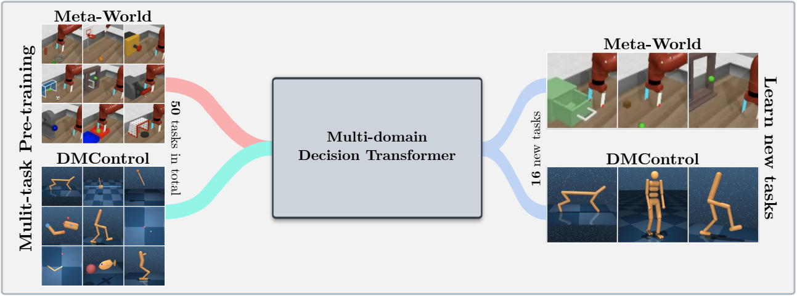
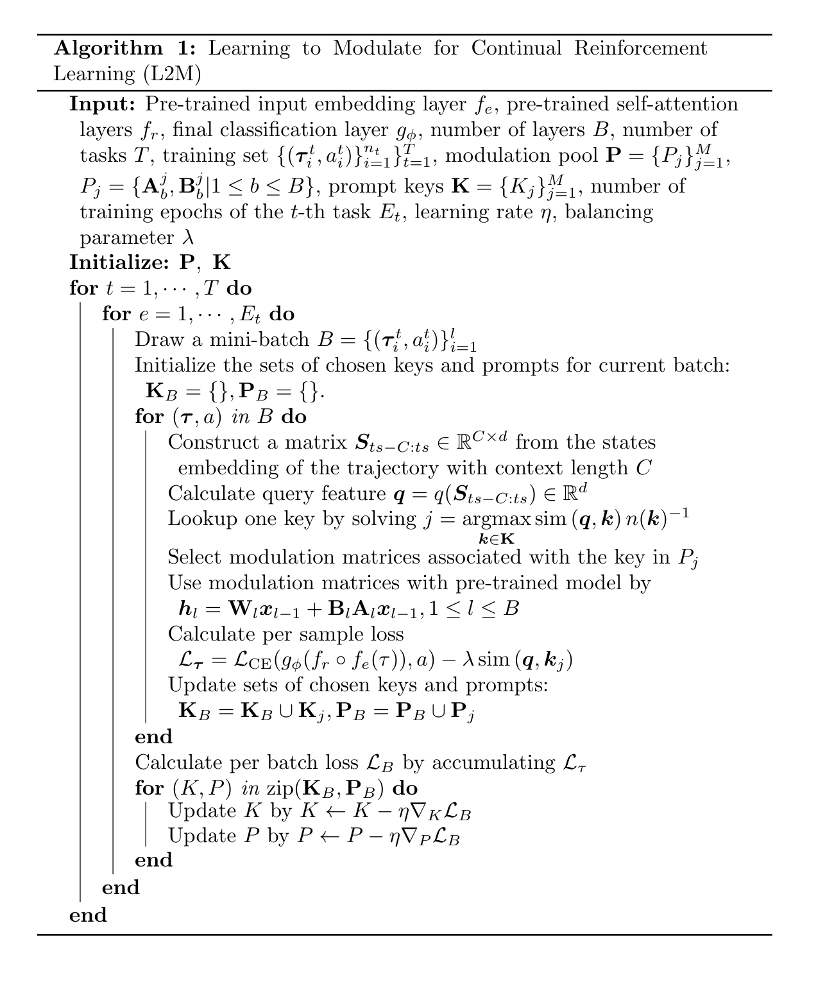

# Continual Reinforcement Learning with Decision Transformer

## Overview

This codebase supports training [Decision Transformer (DT)](https://arxiv.org/abs/2106.01345) models online or from offline datasets on the following domains: 
- [Meta-World](https://github.com/Farama-Foundation/Metaworld) / [Continual-World](https://github.com/awarelab/continual_world)
- [Atari](https://github.com/openai/gym)
- [Gym-MuJoCo](https://github.com/openai/gym)
- [ProcGen](https://github.com/openai/procgen)
- [DMControl](https://github.com/deepmind/dm_control)

What is in this repository?

```
.
├── configs                    # Contains all .yaml config files for Hydra to configure agents, envs, etc.
│   ├── agent_params            
│   ├── wandb_callback_params
│   ├── env_params
│   ├── eval_params
│   ├── run_params
│   └── config.yaml            # Main config file for Hydra - specifies log/data/model directories.
├── continual_world            # Submodule for Continual-World.
├── dmc2gym_custom             # Custom wrapper for DMControl.
├── figures             
├── scripts                    # Scrips for running experiments on Slurm/PBS in multi-gpu/node setups.
├── src                        # Main source directory.
│   ├── algos                  # Contains agent/model/prompt classes.
│   ├── augmentations          # Image augmentations.
│   ├── buffers                # Contains replay trajectory buffers.
│   ├── callbacks              # Contains callbacks for training (e.g., WandB, evaluation, etc.).
│   ├── data                   # Contains data utilities (e.g., for downloading Atari)
│   ├── envs                   # Contains functionality for creating environments.
│   ├── exploration            # Contains exploration strategies.
│   ├── optimizers             # Contains (custom) optimizers.
│   ├── schedulers             # Contains learning rate schedulers.
│   ├── tokenizers_custom      # Contains custom tokenizers for discretizing states/actions.
│   ├── utils                  
│   └── __init__.py
├── LICENSE
├── README.md
├── environment.yaml
├── requirements.txt
└── main.py                     # Main entry point for training/evaluating agents.
```

## Installation

Environment configuration and dependencies are available in `environment.yaml` and `requirements.txt`.

First, create the conda environment.

```bash
conda env create -f environment.yaml
conda activate mddt
```

Then install the remaining requirements (with MuJoCo already downloaded, if not see [here](#MuJoCo-installation)):

```bash
pip install -r requirements.txt
```

<!-- It may be necessary to install PyTorch again, in case GPU is not detected: 
```
pip install torch==1.11.0+cu113 torchvision==0.12.0+cu113 torchaudio==0.11.0 --extra-index-url https://download.pytorch.org/whl/cu113
``` -->

Init the `continualworld` submodule and install:

```bash
git submodule init
git submodule update
cd continualworld
pip install .
```

Install `meta-world`:

```bash
pip install git+https://github.com/rlworkgroup/metaworld.git@18118a28c06893da0f363786696cc792457b062b
```

Install custom version of [dmc2gym](https://github.com/denisyarats/dmc2gym). Our version makes `flatten_obs` optional,
and, thus, allows us to construct the full observation space of all DMControl envs.

```shell
cd dmc2gym_custom
pip install -e .
```

### MuJoCo installation

Download MuJoCo:

```bash
mkdir ~/.mujoco
cd ~/.mujoco
wget https://www.roboti.us/download/mujoco200_linux.zip
wget https://mujoco.org/download/mujoco210-linux-x86_64.tar.gz
unzip mujoco200_linux.zip
tar -xzf mujoco210-linux-x86_64.tar.gz
mv mujoco200_linux mujoco200
mv mujoco210-linux-x86_64 mujoco210
wget https://www.roboti.us/file/mjkey.txt
```

Then add the following line to `.bashrc`:

```bash
export LD_LIBRARY_PATH=$LD_LIBRARY_PATH:~/.mujoco/mujoco200/bin:~/.mujoco/mujoco210/bin:/usr/lib/nvidia:$CONDA_PREFIX/lib
```

#### Troubleshooting on cluster (without root access)

The following issues were helpful:

- https://github.com/openai/mujoco-py/issues/96#issuecomment-678429159
- https://github.com/openai/mujoco-py/issues/627#issuecomment-1383054926
- https://github.com/openai/mujoco-py/issues/323#issuecomment-618365770

First, install the following packages:

```bash
conda install -c conda-forge glew mesalib
conda install -c menpo glfw3 osmesa
pip install patchelf
```

Create the symlink manually:

- https://github.com/openai/mujoco-py/issues/763#issuecomment-1519090452

```bash
cp /usr/lib64/libGL.so.1 $CONDA_PREFIX/lib
ln -s $CONDA_PREFIX/lib/libGL.so.1 $CONDA_PREFIX/lib/libGL.so
```

## Pre-train

### Supervised pre-training

### Self-supervised pre-training

## HiDeLoRA



## Learning to Modulate pre-trained Models in RL

[](https://arxiv.org/abs/2306.14884)

 



## Setup

### Experiment configuration
This codebase relies on [Hydra](https://github.com/facebookresearch/hydra), which configures experiments via `.yaml` files.
Hydra automatically creates the log folder structure for a given run, as specified in the respective `config.yaml` file.

The `config.yaml` is the main configuration entry point and contains the default parameters. The file references the respective default parameter files under the block
`defaults`. In addition, `config.yaml` contains 4 important constants that configure the directory paths:

```yaml
LOG_DIR: ../logs
DATA_DIR: ../data
SSD_DATA_DIR: ../data
MODELS_DIR: ../models
```

### Datasets

The generated datasets are currently hosted via our web-server. Download Meta-World and DMControl datasets to the specified `DATA_DIR`:

```bash
# Meta-World
wget --recursive --no-parent --no-host-directories --cut-dirs=2 -R "index.html*" https://ml.jku.at/research/l2m/metaworld
# DMControl
wget --recursive --no-parent --no-host-directories --cut-dirs=2 -R "index.html*" https://ml.jku.at/research/l2m/dm_control_1M
```

The framework also supports Atari, D4RL, and visual DMControl datasets.
For [Atari](src/data/atari/README.md) and [visual DMControl](src/data/dm_control/README.md), we refer to the respective READMEs.

## Running experiments

In the following, we provide some illustrative examples of how to run the experiments in the paper.

### Pre-training runs

To train a 40M multi-domain Decision Transformer (MDDT) model on MT40 + DMC10 with 3 seeds on a single GPU, run:

```bash
python main.py -m experiment_name=pretrain seed=42,43,44 env_params=multi_domain_mtdmc run_params=pretrain eval_params=pretrain_disc agent_params=cdt_pretrain_disc agent_params.kind=MDDT agent_params/model_kwargs=multi_domain_mtdmc agent_params/data_paths=mt40v2_dmc10 +agent_params/replay_buffer_kwargs=multi_domain_mtdmc +agent_params.accumulation_steps=2
```

### Single-task fine-tuning

To fine-tune the pre-trained model using LoRA on a single CW10 task with 3 seeds, run:

```bash
python main.py -m experiment_name=cw10_lora seed=42,43,44 env_params=mt50_pretrain run_params=finetune eval_params=finetune agent_params=cdt_mpdt_disc agent_params/model_kwargs=mdmpdt_mtdmc agent_params/data_paths=cw10_v2_cwnet_2M +agent_params/replay_buffer_kwargs=mtdmc_ft agent_params/model_kwargs/prompt_kwargs=lora env_params.envid=hammer-v2 agent_params.data_paths.names='${env_params.envid}.pkl' env_params.eval_env_names=
```

### Continual fine-tuning

To fine-tune the pre-trained model using L2M on all CW10 tasks in a sequential manner with 3 seeds, run: (not supported, use original code)

```bash
python main.py -m experiment_name=cw10_cl_l2m seed=42 env_params=multi_domain_ft env_params.eval_env_names=cw10_v2 run_params=finetune_coff eval_params=finetune_md_cl agent_params=cdt_mpdt_disc +agent_params.steps_per_task=100000 agent_params/model_kwargs=mdmpdt_mtdmc agent_params/data_paths=cw10_v2_cwnet_2M +agent_params/replay_buffer_kwargs=mtdmc_ft +agent_params.replay_buffer_kwargs.kind=continual agent_params/model_kwargs/prompt_kwargs=l2m_lora
```

#### HiDe-LoRA

```bash
python main.py -m experiment_name=cw10_cl_tii seed=42 env_params=multi_domain_ft env_params.eval_env_names=cw10_v2 run_params=finetune_tii eval_params=finetune_md_cl agent_params=cdt_tii_mpdt_disc +agent_params.steps_per_task=10000 agent_params.eval_tii_steps=1000 agent_params/model_kwargs=mdmpdt_mtdmc_tii agent_params/data_paths=cw10_v2_cwnet_2M +agent_params/replay_buffer_kwargs=mtdmc_ft +agent_params.replay_buffer_kwargs.kind=continual
```

```bash
python main.py -m experiment_name=cw10_cl_hide_lora seed=42 env_params=multi_domain_ft env_params.eval_env_names=cw10_v2 run_params=finetune_coff eval_params=finetune_md_cl agent_params=cdt_mpdt_disc +agent_params.steps_per_task=100 +agent_params.eval_tii_steps=1000 agent_params/model_kwargs=mdmpdt_mtdmc agent_params/data_paths=cw10_v2_cwnet_2M +agent_params/replay_buffer_kwargs=mtdmc_ft +agent_params.replay_buffer_kwargs.kind=continual agent_params/model_kwargs/prompt_kwargs=hide_lora
```

### Multi-GPU training

For multi-GPU training, we use `torchrun`. The tool conflicts with `hydra`.
Therefore, a launcher plugin [hydra_torchrun_launcher](https://github.com/facebookresearch/hydra/tree/main/contrib/hydra_torchrun_launcher) was created.

To enable the plugin, clone the `hydra` repo, cd to `contrib/hydra_torchrun_launcher`, and pip install the plugin:

```bash
git clone https://github.com/facebookresearch/hydra.git
cd hydra/contrib/hydra_torchrun_launcher
pip install -e .
```

The plugin can be used from the commandline:

```bash
python main.py -m hydra/launcher=torchrun hydra.launcher.nproc_per_node=4 [...]
```

Running experiments on a local cluster on a single node can be done via `CUDA_VISIBLE_DEVICES` to specify the GPUs to use:

```bash
CUDA_VISIBLE_DEVICES=0,1,2,3 python main.py -m hydra/launcher=torchrun hydra.launcher.nproc_per_node=4 [...]
```

On Slurm, executing `torchrun` on a single node works alike. E.g., to run on 2 GPUs on a single node:

```
#!/bin/bash
#SBATCH --account=X
#SBATCH --qos=X
#SBATCH --partition=X
#SBATCH --nodes=1
#SBATCH --gpus=2
#SBATCH --cpus-per-task=32

source activate mddt
python main.py -m hydra/launcher=torchrun hydra.launcher.nproc_per_node=2 [...]
```

Example scripts for multi-gpu training on Slurm or PBS are available in `scripts`.

### Multi-node training

Running on Slurm/PBS in a multi-node setup requires a little more care. Example scripts are provided in `scripts`.
